# Blog SEO Tag Schema Repair Design

Date: 2026-05-29

## Goal

Extend the existing `批量修复 Blog 格式` workspace so published historical Blog posts can be scanned, previewed, and repaired for SEO metadata, WordPress tags, and appropriate schema support. The `中控台` should surface missing Blog SEO/tag/schema issues and route the user directly into the Blog repair workspace with the relevant filter.

This feature should make old posts safer and easier to improve without creating a separate workflow.

## Scope

This design covers published historical WordPress Blog posts.

First-version repairs include:

- AIOSEO title.
- AIOSEO meta description.
- WordPress post tags.
- FAQ schema through existing AIOSEO FAQ blocks.
- Article-style schema readiness signals for normal Blog posts.
- Video schema readiness signals for product video Blog posts that include YouTube embeds.
- Existing Blog format repairs: Gutenberg-friendly content, heading IDs, TOC, CTA, FAQ block, and internal links.

First version does not include:

- Fully automatic publishing without preview.
- AI rewriting entire articles.
- Event schema for exhibition Blog posts unless required event date/location facts are already present and reliable.
- Custom schema database writes beyond what the current WordPress/AIOSEO integration can support safely.
- New top-level app tab.

## Recommended Approach

Add a `SEO/Tag/Schema 修复` mode inside `BlogFormatDashboard`.

This is the best fit because the current Blog Format workflow already has the right operational shape:

- It scans WordPress posts.
- It supports post status, type, search, and limit filters.
- It generates previews before writing.
- It backs up posts before applying changes.
- It already adds FAQ blocks, CTA, internal links, and tags in some apply paths.

The `中控台` remains the discovery layer. It should not repair posts itself. It should detect and prioritize issues, then navigate to `blogFormat` with a filter such as `missing_blog_seo`, `missing_blog_tags`, or `missing_blog_schema`.

## User Workflow

1. User opens `中控台`.
2. The dashboard loads `/seo-health/summary`.
3. Blog issues include missing SEO metadata, missing tags, missing FAQ/schema support, and existing format/content problems.
4. User clicks a Blog issue action.
5. App navigates to `批量修复 Blog 格式` with the matching repair filter.
6. User scans published Blog posts.
7. The list shows each post's SEO repair status: SEO metadata, tags, schema readiness, FAQ, CTA, internal links, and formatting.
8. User selects posts and clicks preview.
9. Preview shows before/after values and exactly what will be written.
10. User applies selected previews.
11. Backend writes a backup first, then updates WordPress content/tags and AIOSEO title/description.

## Blog Repair Modes

The Blog repair workspace should support two related modes:

- `格式修复`: existing behavior for content structure, TOC, CTA, FAQ, related links, and editor-friendly blocks.
- `SEO/Tag/Schema 修复`: adds SEO metadata, tag, and schema checks on top of the existing format preview.

The first implementation can present this as a segmented control or filter select inside the current `批量修复 Blog 格式` screen.

## Issue Model

Each scanned post should report a compact issue summary:

- `missing_seo_title`: AIOSEO title is readable and empty/default.
- `missing_seo_description`: AIOSEO description is readable and empty/default.
- `seo_metadata_unknown`: AIOSEO title/description cannot be read through the current integration, so the post should not be falsely marked as missing.
- `seo_title_too_long`: title over 60 characters.
- `seo_description_too_long`: description over 160 characters.
- `missing_tags`: no WordPress post tags.
- `missing_faq_schema`: no AIOSEO FAQ block and no FAQ section.
- `missing_article_schema_signal`: normal article lacks schema-ready title, description, excerpt, date, and canonical post link data in the preview.
- `missing_video_schema_signal`: product video Blog has YouTube content but lacks video schema-ready data.
- Existing format issues from `build_blog_format_preview_item`.

The backend should keep this deterministic where possible. AI can generate suggested text, but issue detection should be rule-based and explainable.

## SEO Generation

SEO metadata suggestions should use existing content first:

1. Use supplied or existing SEO title if it is valid.
2. Otherwise derive a title from post title, target terms, and article type.
3. Use supplied or existing SEO description if it is valid.
4. Otherwise derive a concise description from excerpt and cleaned article intro.

Generated values should be normalized:

- SEO title: plain text, maximum 60 characters.
- SEO description: plain text, maximum 160 characters.
- No HTML, markdown, quotes as wrappers, or keyword stuffing.
- Prefer one strong long-tail phrase near the front when natural.

If AI generation is available later, it should still pass through the same normalizer and preview gate.

## Tag Generation

Tag suggestions should reuse the existing Blog tag helpers:

- Explicit keyword input when available.
- Known phrase matches such as `product sample`, `portable lantern`, `storage organizer`, `deployment site`, `project case`, and `exhibition recap`.
- Article type tags for exhibition, certificate, project, and video Blog posts.
- Safe n-gram extraction from title, SEO fields, excerpt, content, and keyword context.

Rules:

- Keep 3-10 useful tags per post.
- Preserve existing tags.
- Do not create single generic tags except accepted type tags such as `project`.
- Normalize duplicate singular/plural forms.
- Do not generate hashtags or numbered items.

## Schema Strategy

First version should support schema in the safest practical way:

- FAQ schema: continue using AIOSEO FAQ blocks produced by `append_blog_faq_section`.
- Normal Blog articles: ensure the post has schema-ready metadata and rely on WordPress/AIOSEO's article output unless a verified custom schema endpoint exists.
- Product video Blog posts: detect YouTube embeds and produce a preview of `VideoObject`-ready fields, but only write schema through a supported WordPress/AIOSEO path if one exists.

Schema preview fields:

- `schemaType`: `Article`, `BlogPosting`, `FAQPage`, or `VideoObject`.
- `headline`.
- `description`.
- `mainEntityOfPage`.
- `image` when available.
- `datePublished` and `dateModified` when available from WordPress.
- For video: `name`, `description`, `thumbnailUrl`, `embedUrl`, `uploadDate` when available.

The UI should distinguish between:

- `willWrite`: safe fields that will be written now.
- `readinessOnly`: schema-ready data that is shown for verification but not written because the current integration has no safe writer.

## Backend API Changes

Extend existing Blog endpoints rather than creating a parallel API family.

`GET /blog/bulk-format/posts`

Add optional query:

- `repairMode`: `format` or `seo`
- `issueFilter`: empty, `missing_blog_seo`, `missing_blog_tags`, `missing_blog_schema`, or an issue code

Return additional fields:

- `seoStatus`
- `tagStatus`
- `schemaStatus`
- `issueCodes`
- `seoTitle`
- `seoDescription`
- `tagNames`
- `schemaTypes`

`POST /blog/bulk-format/preview`

Add optional payload:

- `repairMode`
- `issueFilter`

Return additional preview fields:

- `seoBefore`
- `seoAfter`
- `tagsBefore`
- `tagsAfter`
- `schemaPreview`
- `willWrite`
- `readinessOnly`

`POST /blog/bulk-format/apply`

Accept selected preview fields:

- `optimizedHtml`
- `seoTitle`
- `seoDescription`
- `tagNames`
- `blogType`
- `repairMode`

Apply order:

1. Fetch current post.
2. Write backup under `data/blog_format_backups/<run_id>/post-<id>.json`.
3. Merge and sync tags.
4. Update content/excerpt/slug only when included in the preview.
5. Sync AIOSEO title/description through the existing LensCraft AIOSEO endpoint.
6. Return warnings for unsupported schema writes instead of failing the whole repair.

## SEO Health Integration

Extend `_seo_health_blog_result` and `_score_blog_health_items` so the `中控台` can detect Blog SEO/tag/schema issues.

Blog health scan should request enough fields from WordPress to inspect:

- `id`
- `title`
- `slug`
- `link`
- `date`
- `modified`
- `content`
- `excerpt`
- `tags`
- embedded terms when available

If custom AIOSEO values are unavailable through WordPress REST, the first version should treat SEO metadata as `unknown` rather than falsely marking every post missing. If the existing LensCraft AIOSEO endpoint can read post metadata, add a read helper and mark missing/default values precisely.

New `中控台` Blog issue actions:

- Missing Blog SEO -> `blogFormat`, filter `missing_blog_seo`
- Missing Blog tags -> `blogFormat`, filter `missing_blog_tags`
- Missing Blog schema -> `blogFormat`, filter `missing_blog_schema`
- Existing format issues -> `blogFormat`, existing format filter where available

## Frontend UI

Inside `BlogFormatDashboard`:

- Add repair mode control: `格式修复` and `SEO/Tag/Schema 修复`.
- Add issue filter control when SEO repair mode is active.
- Add row badges for SEO, Tags, Schema, FAQ, and Format.
- Add preview sections:
  - Content changes.
  - SEO metadata before/after.
  - Tags before/after.
  - Schema preview and write status.
  - Warnings.
- Keep the existing selected-preview apply workflow.

The UI should avoid implying unsupported schema fields are written. If schema is only prepared, label it as preview/readiness data.

## Data Flow

```mermaid
flowchart LR
  A["中控台 SEO Health"] --> B["Blog issue action"]
  B --> C["Blog Format Dashboard with filter"]
  C --> D["Scan published posts"]
  D --> E["Generate SEO/Tag/Schema preview"]
  E --> F["User reviews selected previews"]
  F --> G["Backup current WordPress post"]
  G --> H["Apply content/tags/AIOSEO fields"]
  H --> I["Return warnings and result links"]
```

## Error Handling

- If WordPress REST scan fails, show the existing REST/Cloudflare guidance.
- If tag creation fails, apply other safe changes and return a tag warning only when possible.
- If AIOSEO sync fails, keep content/tag changes and return an AIOSEO warning.
- If schema write is unsupported, do not fail the repair; return a schema readiness warning.
- If backup cannot be written, do not apply the post.

## Testing

Backend tests should cover:

- Blog SEO issue detection for missing/valid SEO metadata.
- Blog tag issue detection and tag suggestion normalization.
- FAQ schema detection from AIOSEO FAQ blocks.
- Video Blog schema readiness detection from YouTube embeds.
- Preview payload includes before/after SEO, tags, and schema preview.
- Apply backs up before writing and preserves existing tags.
- AIOSEO sync warning does not fail the whole apply response.

Frontend tests should cover:

- `BlogFormatDashboard` renders the repair mode control.
- SEO repair mode shows issue filters and status badges.
- Preview renders SEO before/after, tag before/after, and schema readiness.
- Command Center Blog issue actions navigate to `blogFormat` with the right filter.
- Existing format repair tests continue to pass.

## Acceptance Criteria

1. User can scan published historical Blog posts for SEO/tag/schema issues inside `批量修复 Blog 格式`.
2. User can filter Blog repair by missing SEO, missing tags, and missing schema.
3. `中控台` lists Blog SEO/tag/schema issues and routes to the Blog repair workspace.
4. Preview clearly shows all fields that will change before applying.
5. Applying selected previews writes a backup before any WordPress update.
6. Applying can update AIOSEO title/description, merge tags, and apply safe content-format repairs.
7. FAQ schema continues to use AIOSEO FAQ blocks.
8. Unsupported custom schema writes are reported as warnings, not silently claimed as applied.
9. Existing Blog format repair behavior remains available.

## Open Implementation Notes

- The codebase currently has a write helper for AIOSEO title/description via `/wp-json/lenscraft/v1/aioseo/{id}`. Implementation should verify whether the same plugin exposes a read path. If not, SEO missing checks should be conservative until a read path is added.
- Product video Blog schema can be prepared from existing YouTube metadata helpers, but writing `VideoObject` depends on WordPress/AIOSEO support.
- Exhibition `Event` schema should be a later enhancement unless the post has reliable event name, date, and location fields.
